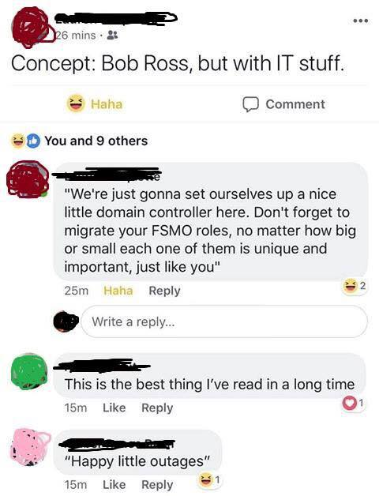

Hi and welcome to Happy Little BSTs.
 
 I hope you are having a great day.
 
  I am your host Adam Wilczek and this is a show where I teach Beginner, Intermediate, and Advanced level IT skills in a way that is easily understandable and hopefully works for you. So if you are a beginner, or know alot you are welcome to sit around and learn in a nice and calming way. 
  
  A bit about me, I'm a Full Stack developer who has experience in all parts of the IT industry. When I was in college I worked for a major retailer's customer support division. During college I also interned as a software developer at a local company learning to work on both websites and types of computer applications. I stayed on with this company after college and I eventually transitioned to the Infrastructure Team. On the Infrastructure team I still wrote software but also got to work with the devices themselves, putting servers in a datacenter and in the cloud. I learned how to network computers together and build large distrubuted systems. I made a few mistakes along the way but the only bad mistakes you make are the ones you don't learn from. I too am learning every day and I hope you learn with me.
  
  One day I was sitting at home and my spouse sent me a facebook message with a picture a facebook post someone had made. The Picture said Concept: Bob Ross, But with IT stuff. 
  
  
  
  After I finished laughing I realized this wasn't just a funny Idea, it might also be able to help people. I like many others out there I suffer from imposter syndrome. Basically it is a feeling where you might feel you aren’t good at what you do, no matter what you accomplish. I know this caused me to struggle while I was learning, and if I help just one person learn in a comfortable way I feel that I will have made the world a better place. I want to tell you, even the masters of the industry were beginners once, and we all learn every day. Thats why it is important to not sweat the small stuff while learning and just have fun doing it, because when what we learn today makes us better than who we were yesterday.
